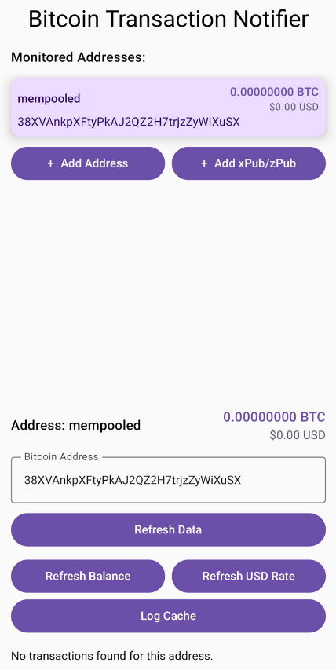

# panopticon

> This is alpha software.

## Motivation

To receive mobile notifications whenever there's a new transaction in your wallet.
You can monitor individual addresses or even whole wallets providing your xpub/zpub.

I couldn't find a wallet that supports notifications privately, which seems like a big gap in the market.

## Installation

- Download it from the releases: https://github.com/OliverOffing/panopticon/releases/
- Use Obtanium to receive updates automatically.

## Developing

- I'm am NOT a mobile developer.
- Most of this code was written using AI.
- I'm using Android Studio, so if you use that I think you'll be able to build it yourself.
